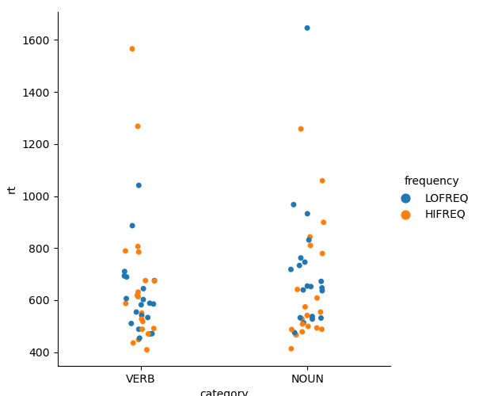
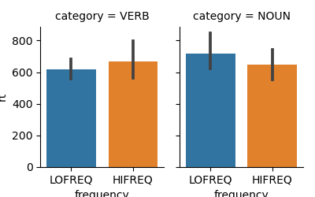

Lexical Decision Experiment
===========================

- Home Page:  <http://chrplr.github.io/PCBS-LexicalDecision>
- Github repository: <https://github.com/chrplr/PCBS-LexicalDecision>

The aim of this project was to create a psycholinguistics experiment implementing a [lexical decision task](https://en.wikipedia.org/wiki/Lexical_decision_task) in the visual modality. 

The experiment consists in a succession of trials in which a written stimulus is displayed on the screen and the participant must indicate, by pressing one of two response keys, if this stimulus is a word or not. The response time is recorded. 

In our experiment, the word stimuli are nouns and verbs of varying lexical frequencies (frequencies of occurrence in the language) to allow us to assess the influences of these two factors (Category: Noun vs. Verb; Frequency: High vs. Low) on the speed of word recognition.

**Table of Contents**

- [Preparation of the stimuli](#preparation-of-the-stimuli)
        * [Words](#words)
        * [Pseudowords](#pseudowords)
- [Creating the list of trials](#creating-the-list-of-trials)
- [Running the experiment](#running-the-experiment)
- [Analyzing the results](#analyzing-the-results)


## Preparation of the stimuli

### Words

To get lexical frequency information, we used the [Lexique database](http://www.lexique.org). More precisely, we downloaded the table `Lexique383.tsv` available at <http://www.lexique.org/databases/Lexique383/Lexique383.tsv> (Under Linux, this can be done with the command line `curl -O http://www.lexique.org/databases/Lexique383/Lexique383.tsv`)

We then randomly selected four subsets of twenty nouns and verbs, of length comprised between 5 and 8 letters, in two frequency ranges. 

The code to randomly pick items verifying some criteria is in the script [select-words-from-lexique.py](https://github.com/chrplr/PCBS-LexicalDecision/blob/master/select-words-from-lexique.py). We ran it as follows:

    mkdir -p stimuli
    python select-words-from-lexique.py -n 20 --cgram NOM --max-freq 5.0 --min-letters 5     \
                                        --max-letters 8 --database Lexique383.tsv  > stimuli/nomlo.txt
    python select-words-from-lexique.py -n 20 --cgram NOM --min-freq 100.0 --min-letters 5   \
                                        --max-letters 8 --database Lexique383.tsv > stimuli/nomhi.txt
    python select-words-from-lexique.py -n 20 --cgram VER --max-freq 5.0 --min-letters 5     \
                                        --max-letters 8 --database Lexique383.tsv  > stimuli/verlo.txt
    python select-words-from-lexique.py -n 20 --cgram VER --min-freq 100.0 --min-letters 5    \
                                        --max-letters 8 --database Lexique383.tsv > stimuli/verhi.txt


Thus, the words for the experiment are saved in the files `nomhi.txt`,  `nomlo.txt`,  `verhi.txt` and `verlo.txt` in the subfolder `stimuli/` 

Here is an example of ouput:

nomhi    | nomlo       |verhi        | verlo 
-------- | ----------- | ----------- | ------------
façon    |    fleuves  |  avait      |  amènera  
cause   |    véranda   |  changer |  dégagée   
bateau   |   vacarme   |  aller   |    envoyons  
équipe   |   bluff   |    parlé   |    sauterai  
école   |    lever   |    avons   |    ralenti   
bureau   |   tarés   |    croyais   |  frustré   
trucs   |    cobra   |    veulent   |  défiguré  
lumière   |  samouraï   | trouver   |  extraire  
besoin   |   mystique   | regardez   | secoué    
début   |    yacks   |    était   |    brouillé  
force   |    contes   |   savais   |   tairai    
reste   |    lézard   |   payer   |    envisage  
travail   |  boche   |    faisait   |  données   
homme   |    raton   |    rentrer   |  abrite    
faute   |    piercing   | ferais   |   apaiser   
années   |   frayeur   |  parlez   |   bousculé  
bonjour   |  dérision   | demander   | parleras  
table   |    citation   | donnez   |   cuits     
heures   |   entrées   |  parles   |   perdant   
hommes   |   réforme   |  jouer   |    rallume   


### Pseudowords

To create 80 pseudowords, we used the [Wuggy pseudoword generator](http://crr.ugent.be/programs-data/wuggy), feeding it with the words generated at the previous step.

We obtained 80 pseudowords, that we saved in the file `stimuli/pseudomots.txt`

## Creating the list of trials

Finally, we wrote [create-experimental-list.py](https://github.com/chrplr/PCBS-LexicalDecision/blob/master/create-experimental-list.py) to merge the the files `nomlo.txt`, `nomhi.txt`, `verhi.txt`, `verlo.txt` and `pseudomots.txt` into a single csv file (`resources/trials.csv`) describing the trials.


    python create-experimental-list.py > resources/trials.csv

This file has three columns named Category','Frequency' and 'Item':

    head resources/trials.csv
    Category,Frequency,Item
    NOUN,HIFREQ, façon
    NOUN,HIFREQ, cause
    NOUN,HIFREQ, bateau
    NOUN,HIFREQ, équipe
    NOUN,HIFREQ, école
    NOUN,HIFREQ, bureau
    NOUN,HIFREQ, trucs
    NOUN,HIFREQ, lumière
    NOUN,HIFREQ, besoin


## Running the experiment

To run the experiment on your computer, you must have Python and the modules listed in [requirements.txt](https://github.com/chrplr/PCBS-LexicalDecision/blob/master/requirement.txt) installed <sup>[1](#conda_install)</sup>


Once Python and the relevant modules are installed, you can download <http://github.com/chrplr/PCBS-LexicalDecision/archive/refs/heads/master.zip> and unzip it. 

The experiment is ran with the script [run-lexical-decision.py](https://github.com/chrplr/PCBS-LexicalDecision/blob/master/lexical-decision.py):

    cd PCBS-LexicalDecision
    python run-lexical-decision.py resources/trials.csv
      

## Analyzing the results

After each run of `lexical-decision.py`, a file (with extension `.xpd`) is created in the subfolder named `data`. 

It is possible to visualize and analyze the results stored in such file by passing it as argument to the script [analyze-lexical-decision-times.py](https://github.com/chrplr/PCBS-LexicalDecision/blob/master/analyze-lexical-decision-times.py). For example:

    python analyze_lexical_decision-times.py data/lexical-decision_01_202103282213.xpd

This generates  the following graphics (with our data), showing the reactions times as a function of Category (Noun vs. Verb) and Lexical Frequency (High or low)




Average Reaction times:



And computes the ANOVA of logRT as a function of Category (Noun vs. Verb) and Lexical Frequency (High or low):

```
                      df    sum_sq   mean_sq         F    PR(>F)
frequency            1.0  0.004681  0.004681  0.295198  0.588498
category             1.0  0.012364  0.012364  0.779794  0.379989
frequency:category   1.0  0.020338  0.020338  1.282675  0.260963
Residual            76.0  1.205025  0.015856       NaN       NaN
```

---

<a name="conda_install">1</a>: On our system (Ubuntu 20.04 with Anaconda Python 3), we used: 

     conda create --name lexdec python=3.7
     conda activate lexdec
     pip install -r requirements.txt

