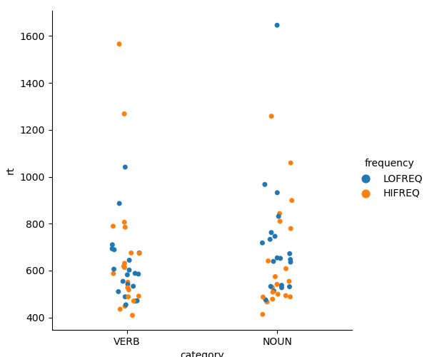
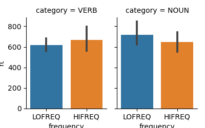

Lexical Decision Experiment
===========================

The aim of this project was to create a psycholinguistics experiment implementing a lexical decision task in the visual modality. 

The experiment consists in a succession of trials in which a written stimulus is displayed on the screen and the participant must indicate, by pressing one of two response buttons, if this stimulus is a word or not. The response time is recorded. 

The word stimuli are nouns and verbs of varying lexical frequencies (frequencies of occurrence in the language) to allow us to assess the influences of these two factors (Category: noun vs. verb; Frequency: high vs. low) on the speed of word recognition.


<!-- markdown-toc start - Don't edit this section. Run M-x markdown-toc-refresh-toc -->
**Table of Contents**

- [Lexical Decision Experiment](#lexical-decision-experiment)
    - [Preparation of the stimuli](#preparation-of-the-stimuli)
        - [Words](#words)
        - [Pseudowords](#pseudowords)
    - [Experimental list](#experimental-list)
    - [Experiment](#experiment)
    - [CONCLUSION](#conclusion)

<!-- markdown-toc end -->


## Preparation of the stimuli

### Words

We used the database Lexique383 available at 'http://www.lexique.org/databases/Lexique383/Lexique383.tsv'

We selected 4 subsets of nouns and verbs, of length comprosed between 5 and 8, with the following script (`select-word-from-lexique.py`):

     python select_word_from_lexique.py 

This yielded 4 lists of 20 items in four files:

    nomhi.txt  nomlo.txt  verhi.txt  verlo.txt


### Pseudowords

To create 80 pseudowords, we used the lexique toolbox pseudoword generator (<http://www.lexique.org/toolbox/toolbox.pub/index.php?page=non_mot>), feeding it with the words generated at the previous step.

We obtained 80 pseudowords, listed in the file `pseudomots.txt`

## Experimental list

Importing the files `nomhi.txt  nomlo.txt  verhi.txt  verlo.txt and pseudomots.txt` into Openoffice Calc, we created a csv file `stimuli.csv`, with 3 columns:


    $ head stimuli.csv
    Category,Frequency,Item
    NOUN,HIFREQ,ordres
    NOUN,HIFREQ,reste
    NOUN,HIFREQ,couteau
    NOUN,HIFREQ,poisson
    ...


## Experiment

To run the experiment:

    python lexical-decision.py
    
    
## Analyze the results

After each run of lexical-decision.py, a new file is created in the `data` folder. It is possible to visualize and analyze the results in a data file by passing it as argument to the script `analyze_lexical_decision.py``. For example:

    python analyze_lexical_decision.py data/lexical-decision_01_202103282213.xpd


This generates (for our data) the following graphics, showing the reactions times as a function of Category (Noun vs. Verb) and Lexcal Frequency (High or low)




Average Reaction times:



And computes the ANOVA of logRT as a function of Category (Noun vs. Verb) and Lexcal Frequency (High or low):

```
                      df    sum_sq   mean_sq         F    PR(>F)
frequency            1.0  0.004681  0.004681  0.295198  0.588498
category             1.0  0.012364  0.012364  0.779794  0.379989
frequency:category   1.0  0.020338  0.020338  1.282675  0.260963
Residual            76.0  1.205025  0.015856       NaN       NaN
```


